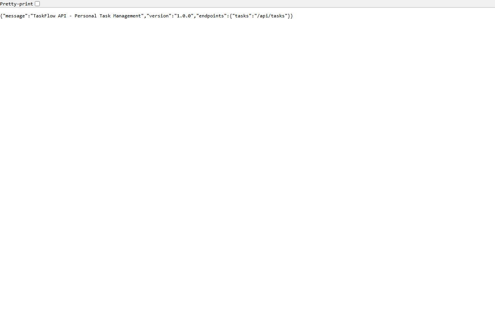
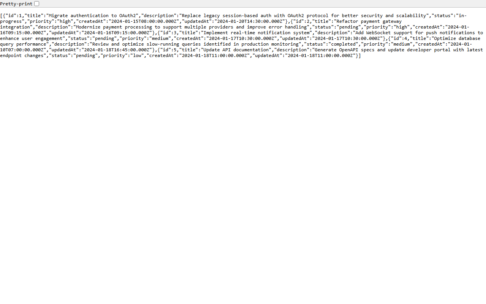
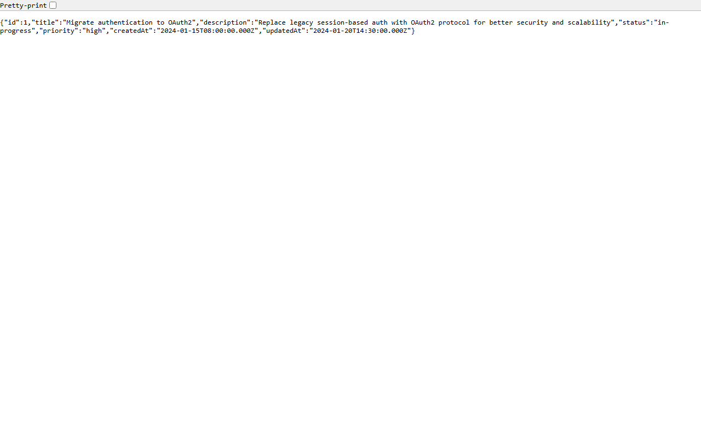
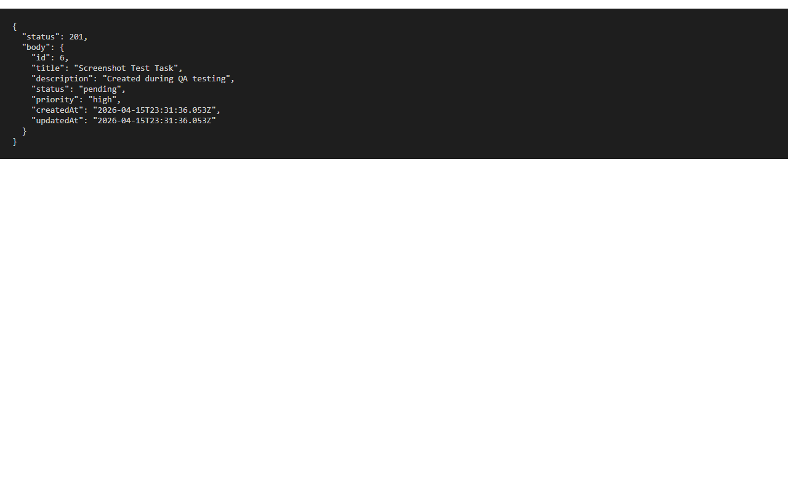

## Overview

This hands-on lab introduces **SQUAD**, a multi-agent framework for agentic software development. You will start with a simple legacy REST API and use SQUAD's specialized agents to iteratively modernize, extend, and improve the codebase — experiencing first-hand how coordinated AI agents collaborate on real development tasks.

The starting point is the **TaskFlow API**, a lightweight Node.js/Express service that exposes a task-management interface. As shown below, the API returns service metadata and available endpoints at its root:



Throughout the lab you will apply SQUAD agents to add features, refactor code, and improve the overall architecture of this application.

## The Legacy Application

TaskFlow API is a minimal REST service built with **Express.js** and **Node.js**. It stores tasks in an in-memory array and exposes CRUD endpoints for managing them. This intentionally simple design gives SQUAD agents a clear, well-scoped canvas to work with.

### Browsing Tasks

The API ships with five seed tasks covering common engineering work items such as auth migration, payment refactoring, and database optimization. Fetching all tasks returns the full collection:



You can also retrieve a single task by its ID, which returns every field including title, description, status, priority, and timestamps:



### Creating & Error Handling

New tasks are created via `POST /api/tasks`. The API auto-assigns an ID, sets a default status, and records timestamps:



Requesting a task that does not exist returns a clear 404 error, which is useful for testing error-handling improvements later in the lab:


---

## Initial Application Screenshots

The TaskFlow API is a Node.js/Express REST API that serves as the starting canvas for the SQUAD lab. Below are screenshots of the initial application state before any SQUAD agents are applied.

### API Root (`GET /`)
Returns service metadata including version and available endpoints.


### List All Tasks (`GET /api/tasks`)
Returns the five seed tasks pre-loaded in the in-memory store, covering auth migration, payment refactoring, notifications, DB optimization, and API docs.


### Get Task by ID (`GET /api/tasks/1`)
Returns a single task object with all fields (id, title, description, status, priority, timestamps).


### Create a Task (`POST /api/tasks`)
Demonstrates successful task creation (HTTP 201) with auto-assigned id, default status, and timestamps.


### Task Not Found (`GET /api/tasks/999`)
Shows the 404 error response when requesting a non-existent task.


---

## Step-by-Step Lab Guide

The following sections walk through each step of the lab with expected CLI outputs. Full output logs are available in `assets/outputs/`.

### Step 1: Clone and Run the Starter API

Clone the repository, install dependencies, and start the server:

```bash
git clone https://github.com/EmeaAppGbb/appmodlab-getting-started-with-squad.git
cd appmodlab-getting-started-with-squad
npm install && npm start
```

Expected output:
```
audited 69 packages in 1s
15 packages are looking for funding
found 0 vulnerabilities

> taskflow-api@1.0.0 start
> node src/index.js
TaskFlow API running on port 3000
```

Test the API:
```bash
curl http://localhost:3000/
```
```json
{
  "message": "TaskFlow API - Personal Task Management",
  "version": "1.0.0",
  "endpoints": { "tasks": "/api/tasks" }
}
```

📄 Full output: [`assets/outputs/step-01-npm-install-and-start.txt`](assets/outputs/step-01-npm-install-and-start.txt)

---

### Step 2: Initialize SQUAD

Create the `.squad/` directory with team configuration:

```bash
mkdir .squad
```

Create `.squad/config.yml` with project metadata and agent definitions, and `.squad/team.md` with the team roster and working agreements.

Expected directory structure:
```
.squad/
├── config.yml    # Project and agent settings
└── team.md       # Team roster & working agreements
```

📄 Full output: [`assets/outputs/step-02-initialize-squad.txt`](assets/outputs/step-02-initialize-squad.txt)

---

### Step 3: Configure Agents

Create individual agent charters in `.squad/agents/`:

```
.squad/agents/
├── brain.md   # 🧠 Architect & Planner
├── hands.md   # 🤲 Implementer
├── eyes.md    # 👁️ Code Reviewer
├── mouth.md   # 📢 Documentarian
└── ralph.md   # 🔧 CI/CD & DevOps
```

Each charter defines the agent's identity, responsibilities, output artifacts, constraints, and communication style.

📄 Full output: [`assets/outputs/step-03-configure-agents.txt`](assets/outputs/step-03-configure-agents.txt)

---

### Step 4: Run Planning Session

Brain analyzes the codebase and creates a prioritized backlog:

```
Identified Gaps:
1. 🔴 NO INPUT VALIDATION
2. 🔴 NO ERROR HANDLING
3. 🟡 NO LOGGING
4. 🟡 NO TESTS
5. 🟢 NO API DOCS
6. 🟢 NO CI/CD

Backlog created with 6 tasks (TASK-001 through TASK-006)
Architecture decisions recorded: ADR-001 (Joi), ADR-002 (Winston)
```

📄 Full output: [`assets/outputs/step-04-planning-session.txt`](assets/outputs/step-04-planning-session.txt)

---

### Step 5: Execute First Task — Input Validation

Hands implements TASK-001 using Joi:

```bash
npm install joi
```

Test validation:
```bash
# Missing title → 400
curl -X POST http://localhost:3000/api/tasks -H "Content-Type: application/json" -d '{}'
```
```json
{"error":"Validation failed","details":[{"field":"title","message":"Title is required"}]}
```

```bash
# Valid task → 201
curl -X POST http://localhost:3000/api/tasks -H "Content-Type: application/json" \
  -d '{"title":"Valid task","priority":"high"}'
```
```json
{"id":6,"title":"Valid task","status":"pending","priority":"high","createdAt":"...","updatedAt":"..."}
```

📄 Full output: [`assets/outputs/step-05-input-validation.txt`](assets/outputs/step-05-input-validation.txt)

---

### Step 6: Review Implementation

Eyes reviews the code changes from TASK-001:

```
Review Results:
  ✅ Joi schemas with custom error messages
  ✅ stripUnknown prevents mass assignment
  ✅ abortEarly: false returns all errors at once
  🟢 Suggestion: extract constants to shared module
  🟢 Suggestion: future controller extraction

VERDICT: ✅ APPROVED — 0 critical, 0 warnings, 2 suggestions
```

📄 Full output: [`assets/outputs/step-06-code-review.txt`](assets/outputs/step-06-code-review.txt)

---

### Step 7: Document Changes

Mouth creates and updates documentation:

- `docs/api.md` — Full API endpoint reference
- `CHANGELOG.md` — Version history
- `CONTRIBUTING.md` — Development workflow
- `README.md` — Updated project structure

📄 Full output: [`assets/outputs/step-07-documentation.txt`](assets/outputs/step-07-documentation.txt)

---

### Step 8: Iterate — Error Handling, Logging, Tests

Three more tasks through the SQUAD cycle:

**TASK-002: Error Handling**
```bash
curl http://localhost:3000/api/tasks/999
```
```json
{"error":"NotFoundError","message":"Task not found"}
```

**TASK-003: Logging**
```bash
npm install winston
npm start
# Server log: info: TaskFlow API running on port 3000
# Request log: info: request completed {"method":"GET","url":"/api/tasks","statusCode":200,"duration":"3ms"}
```

**TASK-004: Test Suite**
```bash
npm install --save-dev jest supertest
npm test
```
```
 PASS  tests/tasks.test.js
  GET /                                    ✓ (52 ms)
  GET /api/tasks                           ✓ (8 ms)
  GET /api/tasks/:id (found)               ✓ (9 ms)
  GET /api/tasks/:id (not found)           ✓ (27 ms)
  POST /api/tasks (valid)                  ✓ (47 ms)
  POST /api/tasks (missing title)          ✓ (7 ms)
  POST /api/tasks (title too long)         ✓ (6 ms)
  POST /api/tasks (invalid status)         ✓ (7 ms)
  POST /api/tasks (invalid priority)       ✓ (6 ms)
  PUT /api/tasks/:id (valid)               ✓ (8 ms)
  PUT /api/tasks/:id (not found)           ✓ (19 ms)
  PUT /api/tasks/:id (empty body)          ✓ (6 ms)
  DELETE /api/tasks/:id (found)            ✓ (11 ms)
  DELETE /api/tasks/:id (not found)        ✓ (7 ms)
  404 catch-all                            ✓ (6 ms)

Tests: 15 passed, 15 total
```

📄 Full output: [`assets/outputs/step-08-iterate.txt`](assets/outputs/step-08-iterate.txt)

---

### Step 9: Retrospective

Brain reviews what SQUAD produced:

| Metric | Before | After |
|--------|--------|-------|
| Source files | 3 | 9 |
| Tests | 0 | 15 (100% pass) |
| Validation rules | 0 | 6 |
| Error classes | 0 | 3 |
| Logging | console.log | Winston |
| Documentation | 1 file | 4 files |

Tasks completed: 5/6 (83%). CI/CD pipeline deferred to next sprint.

📄 Full output: [`assets/outputs/step-09-retrospective.txt`](assets/outputs/step-09-retrospective.txt)
